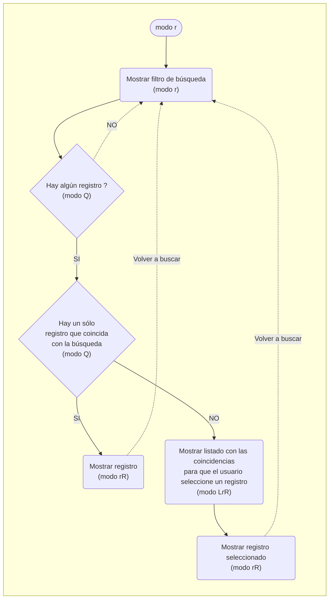

# MODO Read

```mermaid
graph BT
subgraph &nbsp;
A([ modo r ]) -->B("Mostrar filtro de búsqueda<br>(modo r)")
B --> C{"Hay algún registro ?<br>(modo Q)"}
C -->|SI| D{"Hay un sólo <br>registro que coincida<br>con la búsqueda<br>(modo Q)"}
C -.->|NO| B
D -->|SI| E("Mostrar registro<br>(modo rR)")
E -.->| Volver a buscar | B
D -->|NO| F("Mostrar listado con las coincidencias<br>para que el usuario seleccione un registro<br>(modo LrR)")
F -->|  | G("Mostrar registro seleccionado<br>(modo rR)")
G -.->| Volver a buscar | B
end
```

